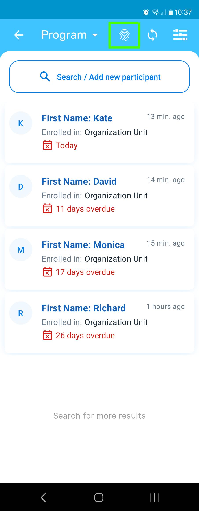

# SimCapture

SimCapture is a fork of the [DHIS2 Android app](https://github.com/dhis2/dhis2-android-capture-app) that adds an integration with the [Simprints ID app](https://github.com/Simprints/Android-Simprints-ID) to use its biometrics features.

General scheme of SimCapture interactions with other software components and roles:

```
┌──────────────────────────────────────────────────────┐
│          Healthcare worker's Android device          │
│                                                      │ 
│ ┌────────────────┐  Beneficiary's  ┌──────────────┐  │ Biometric scan
│ │                │    unique ID    │              │  │ of finger/face
│ │   SimCapture   │ --------------> │ Simprints ID │ <----------------- Beneficiary
│ │   (this app)   │ <-------------- │ (separately) │  │                 (patient)
│ │                │    biometric    │              │  │
│ └────────────────┘  match? yes/no  └──────────────┘  │
│                ^                                     │
│                |                                     │
└────────────────|─────────────────────────────────────┘
                 |
                 | (internet connection)
                 |
                 | Healthcare
                 | data
         DHIS2   v
DHIS2    config ┌────────────────────────┐
instance -----> │ DHIS2 instance backend │
admin           └────────────────────────┘
```

## Contents
* [Features different from the upstream](#features-different-from-the-upstream)
* [How DHIS2 and Simprints data models combine and interact in SimCapture](#how-dhis2-and-simprints-data-models-combine-and-interact-in-SimCapture)
* [DHIS2 backend instance configuration for SimCapture](#dhis2-backend-instance-configuration-for-SimCapture)
  1. [Configure the project-to-program linkages (mappings) in the Datastore](#1-configure-the-project-to-program-linkages-mappings-in-the-datastore)
  2. [Configure the org-unit-to-module linkages (mappings) in the Datastore](#2-configure-the-org-unit-to-module-linkages-mappings-in-the-datastore)
  3. [Configure the Simprints GUID attribute in the Maintenance section](#3-configure-the-simprints-guid-attribute-in-the-maintenance-section)
* [Development](#development)
  1. [Engineering values](#engineering-values)
  2. [Automated fork syncing with the upstream](#automated-fork-syncing-with-the-upstream)
* [Original DHIS2 info](#original-dhis2-info)


## Features different from the upstream

There are 4 biometrics features that are available in SimCapture at the prototype stage, given that the DHIS2 backend instance which the app user is signed into is configured accordingly (see below about that):

1. Biometric enrollment of a tracked entity instance (known as TEI, a person, a patient, or a beneficiary of healthcare programs).
2. Biometric verification of a TEI, to check if the TEI's current biometric reading matches the prior biometric enrollment.
3. Biometric identification of TEIs, to find which TEIs match the prior biometric enrollments given the current biometric reading.
4. Biometric unlocking of program stages in TEI profiles for viewing (within an unlock expiration period), by performing biometric verification of a TEI.

In the UI/UX of the SimCapture app, there biometric features are available in the following places:

| UI item                                        | Place in app                  | Visible when                                                                                           | UI on screen (prototype)  | Simprints biometric features used                                                                                                   |
|------------------------------------------------|-------------------------------|--------------------------------------------------------------------------------------------------------|---------------------------|-------------------------------------------------------------------------------------------------------------------------------------|
| 1. Biometric Enroll / Verify button            | TEI profile record view       | When TEI isn't enrolled / wasn't verified or identified recently (program stages locked in the record) |  | **Enroll** (if not enrolled yet), **Verify**, or none (_Biometrics unavailable_ if program not configured for Simprints biometrics) |
| 2. Biometric Enroll / Verify button            | TEI profile record editor     | When program is configured for Simprints biometrics                                                    |  | **Enroll** (if not enrolled yet) or **Verify**                                                                                      |
| 3. Biometric Lock indicator for program stages | TEI profile record view       | Always (program stages will be visible below if record is unlocked)                                    |  | -                                                                                                                                   |
| 4. Biometric Search button                     | TEIs view/search list toolbar | When the viewed program is configured for Simprints biometrics                                         |  | **Identify**                                                                                                                        |


Notes:
* Biometric Search results are displayed in the similar way as regular DHIS2 search results, however: pressing Back exits the search result list back into all TEI list.
* Simprints GUID is a unique value for a TEI but in the Simprints ID app. Depending on the configuration of the DHIS2 instance backend the SimCapture app user is signed in to, healthcare programs can have a `simprintsGuid` field (tracked entity attribute). If `simprintsGuid` attribute is present in a program, TEIs within that program are either biometrically enrolled (if `simprintsGuid` value is not empty) and are subject to further biometric verification (and locking) or identification. Or, they are not yet biometrically enrolled (if `simprintsGuid` value is empty) and are subject to enrollment.
* A healthcare program may be configured by an admin of the DHIS2 instance backend to be linked to some certain Simprints-specific identifiers (see below for details). If such a linking is configured properly for a given program, the SimCapture app will download that data during a sync with the DHIS2 backend, and biometric features and their UI items will be enabled.


## How DHIS2 and Simprints data models combine and interact in SimCapture

SimCapture is intended to connect to Simprints ID, so the data models shared between the two apps are conceptually related, approximately the following way:

| Concept \ App                                                   | DHIS2             | Simprints ID |
|-----------------------------------------------------------------|-------------------|--------------|
| A healthcare solution that the TEIs (beneficiaries) enroll into | Program           | Project      |
| Geographical area or a healthcare facility                      | Organisation Unit | Module       |

SimCapture syncs linkages between DHIS2 program unique identifiers (UIDs) and Simprints Project IDs, and linkages between DHIS2 organizational unit UIDS and Simprints Module IDs, from the backend of the DHIS2 instance that the SimCapture user is signed into.

For each Program, as described for the UI section above, there are a couple more configurable objects:
* Simprints biometric matching minimum score threshold - to let SimCapture determine whether a given biometric result qualifies as a positive (successful) biometric match or not.
* Biometric locking timeout - to let SimCapture determine for how long to consider a TEI profile freely viewable since the last successful biometric match - via Simprints ID-based enrollment (always), verification or identification.

Therefore, in a JSON form an example of a list of one project-to-program linkage would be:

```json
[
    {
        "biometricLockingTimeoutMinutes": 1,
        "matchConfidenceScoreThreshold": 40,
        "programUid": "LO7JkBO8MYX",
        "projectId": "EjeDzhGQeEk8LvcVDJ2p"
    }
]
```

and an example of a list of one org-unit-to-module linkage:

```json
[
      {
        "moduleId": "WholeCountryModuleId",
        "orgUnitUid": "QCqpTswPImd"
      }
]
```

## DHIS2 backend instance configuration for SimCapture

A standard DHIS2 backend instance can be used, which means, its source code does not require modifications. Instead, an admin logs in into the running standard instance through browser and configures the instance. The following configurations steps are required:


### 1. Configure the project-to-program linkages (mappings) in the Datastore

Go to top-right `Menu` -> `Datastore Management`. On the top left, press `New` to create a new `simprints` namespace (if absent), with the key name `projectIdMapping`. If the `simprints` namespace is already present, add the `projectIdMapping` key to it via a 3-dot menu button.

In the `projectIdMapping`, in the editor, input the list of mappings, where each item is an object consisting of the text key-value entries:

| Project ID mapping key           | Project ID mapping value description                                                                      | Value type     |
|----------------------------------|-----------------------------------------------------------------------------------------------------------|----------------|
| `programUid`                     | DHIS-specific unique ID of a healthcare program                                                           | Text           |
| `projectId`                      | Simprints Project ID                                                                                      | Text           | 
| `matchConfidenceScoreThreshold`  | Minimal confidence score for SimCapture to consider biometric match a success                             | Integer number |
| `biometricLockingTimeoutMinutes` | Max time since the last successful biometric function result on TEI, for which the TEI is freely viewable | Integer number |

Notes:
* To view `programUid` of a Program, go to top-right `Menu` -> `Maintenance` -> `Program` -> `Program`. In the list of Programs, locate the one of an interest, press the 3-dot menu button on the right of it, and select `Show details`. The `programUid` value will be in the `Id` section.
* Absent or incorrect `programUid` or `projectId` value would result into the Program not supporting biometric functions.
* Absent or non-positive `matchConfidenceScoreThreshold` value would effectively make it 0, so then anything that Simprins ID returns is a match for SimCapture.
* Non-positive or absent `biometricLockingTimeoutMinutes` value would effectively make it 0, so then a TEI profile needs to be biometrically unlocked before every viewing.

Also see the JSON example above.


### 2. Configure the org-unit-to-module linkages (mappings) in the Datastore

Go to top-right `Menu` -> `Datastore Management`. On the top left, press `New` to create a new `simprints` namespace (if absent), with the key name `moduleIdMapping`. If the `simprints` namespace is already present, add the `moduleIdMapping` key to it via a 3-dot menu button.

In the `moduleIdMapping`, in the editor, input the list of mappings, where each item is an object consisting of the text key-value entries:

| Module ID mapping key | Module ID mapping value description                                | Value type |
|-----------------------|--------------------------------------------------------------------|------------|
| `orgUnitUid`          | DHIS-specific unique ID of an organization unit (area or facility) | Text       |
| `moduleId`            | Simprints Module ID                                                | Text       |

Notes:
* To view `orgUnitUid` of an Organization Unit, go to top-right `Menu` -> `Maintenance` -> `Organisation unit` -> `Organisation unit`. In the list of Organization Units, locate the one of an interest, press the 3-dot menu button on the right of it, and select `Show details`. The `orgUnitUid` value will be in the `Id` section.
* Absent or incorrect `orgUnitUid` or `moduleId` value would result into the Organization Unit not having an associated Simprints Module ID.
* Organization Units are hierarchically structured. If an Organization Unit has no Simprints Module ID, then its nearest parent's Simprints Module ID will be used by SimCapture, if available. If the top level Organization Unit has a Simprints Module ID set, that's effectively a default Module ID.

Also see the JSON example above.


### 3. Configure the Simprints GUID attribute in the Maintenance section

When a TEI (beneficiary) is biometrically enrolled via the Simprints ID app, the latter returns a unique ID (GUID) for the beneficiary. Simprints ID will need this GUID later when called from SimCapture for verification of that TEI or for identification. So TEI needs to have a data field for storing the Simprints GUID. In the DHIS instance admin's web UI, such a new field for TEIs within a given healthcare Program can be added, as a tracked entity attribute. SimCapture requires its short name to be `simprintsGuid`.

To add a tracked entity attribute, go to the top-right `Menu` -> `Maintenance` -> `Program` -> `Tracked entity attribute`. On the bottom-right press `+` to add new. Fill in Name: `Simprints GUID`, Short name: `simprintsGuid`, select Value type: `Text`, Aggregation type: `None`, and press `Save` on the bottom.

The `simprintsGuid` tracked entity attribute exists at this point, but isn't added to any Program. To do so, go to the top-right `Menu` -> `Maintenance` -> `Program` -> `Program`. Press the Program of interest, then `(3) Attributes`. In the left list locate and select `Simprints GUID`, then press `->` between the two lists to move `Simprints GUID` to the right list. Press `Save` on the bottom. Now each TEI within this Program does have a space where SimCapture can write a Simprints GUID into.


## Development

### Engineering values

Considering that SimCapture is a fork of the original DHIS2 upstream, it is effectively a diff from the original DHIS2. The upstream may change considerably over time. Therefore, to keep the complexity of SimCapture development in check, it may be useful to:
* Keep the fork's diff from the upstream reasonably minimal.
* Avoid modification and removal of the lines of upstream code, where reasonable.
* Maintain a check on how deep the blending of the fork implementations into upstream code is, to reduce operational complexity.


### Automated fork syncing with the upstream

A [sync-from-upstream](https://github.com/Simprints/SimCapture/blob/main/.github/workflows/sync-from-upstream.yml) GitHub Action periodically creates a pull request to merge the changes from the upstream into this fork.


## Original DHIS2 info

[](https://sonarcloud.io/summary/new_code?id=dhis2_dhis2-android-capture-app)
[](https://sonarcloud.io/summary/new_code?id=dhis2_dhis2-android-capture-app)

Check the [Wiki](https://github.com/dhis2/dhis2-android-capture-app/wiki) for information about how to build the project and its architecture **(WIP)**

### What is this repository for? ###

DHIS2 Android application.
